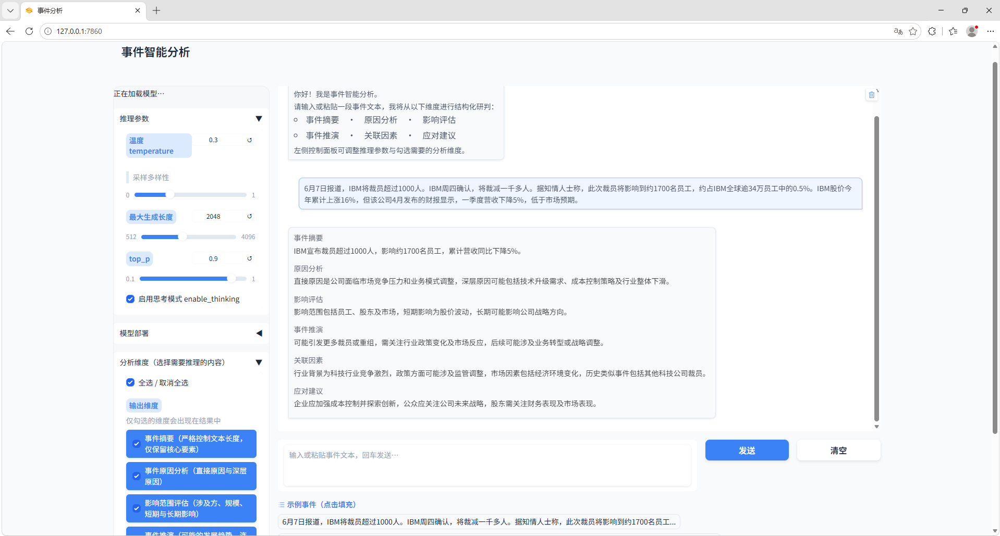

# Event-Intelligent-Analysis-Assistant

基于 Qwen3-0.6B 的事件分析模型训练与推理代码。整体流程：教师蒸馏 → 偏好对齐（DPO/KTO）→ 权重合并 → 推理 → Web 应用。

## 技术路线

1. **KD-LoRA**：以 Qwen3-8B 为教师生成蒸馏样本，硬标签 + logits 级 KL 软蒸馏联合训练 Qwen3-0.6B
2. **偏好对齐**：对比 DPO 与 KTO；DPO 因正负样本区分度不足导致输出退化，最终采用 KTO 配合早停抑制过拟合
3. **部署**：LoRA 权重合并为完整模型，提供批量推理脚本与 Gradio Web UI

## 目录结构

```
code/           训练、合并、推理、Web 应用代码（详见 code/README.md）
data/           训练数据
base_dataset/   原始训练/验证集
save_models/    各阶段模型权重与 LoRA adapter
result/         批量推理结果
log/            训练日志
```

## 快速开始

```bash
pip install -r code/requirements.txt

cd code

# 训练（按流水线顺序，按需执行）
python KD/train.py               # KD-LoRA
python -m KTO.train              # KTO

# 批量推理
python infer.py --data ../data/event_top10.jsonl --output ../result/out.jsonl \
    --model ../save_models/Qwen3-0.6B-KTO --device 0

# Web UI
python web.py --device 0
```

训练与推理均需 GPU；量化推理依赖 bitsandbytes。各阶段详细说明见 [code/README.md](code/README.md)。
